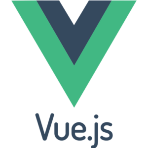

# Z-Wallet Website

 

## Table of Contents
- Introduction
- Features
- Requirements
- Usage
- Create Environment Variable
- Screenshots
- Related Project

### Introduction
<b>z wallet</b> is an online website that operates in the fintech sector, which provides an easier and faster transfer feature to fellow users. The hope is that the z wallet can expand fintech in Indonesia, and make it easier to transfer money to one another
### Features
- Users/Customers who are not logged in can only view landing page
- Users/Customers must sign up and sign in to send money to each other and see their profiles
- Users/Customers can add more than one cellphone number, and choose which one to be the primary phone number
- And others

### Requirements
- [npm](https://www.npmjs.com/package/module)
- [vue.js](https://www.vuejs.org)
- [vue.js-cli](https://cli.vuejs.org)
- [backend-Zwallet](https://github.com/Friemorn/BackEnd-PaymentApp-ZWallet)

### Usage for development
Open your terminal or command prompt
Type git clone https://github.com/alanard/frontend-zwallet/
Open the folder and type npm install for install dependencies
Create Environment Variable here
Before run this, you must run backend first
Type npm run serve if you use npm, or yarn serve if you use yarn, for run this app. Make sure your device is connected with debugging mode.

### Create Environment Variable
`
$ cp .env.example .env
`
`
$ nano .env
`
### Set API KEY
`
VUE_APP_BASE_URL=YOUR_HOST_URL
`
## Screenshots

 
 
 
  
  
  

### Related Project (Backend)

[backend-Z-Wallet](https://github.com/Friemorn/BackEnd-PaymentApp-ZWallet)

## Team

> All Members of Default Team

| <a href="https://blog.udacity.com/2014/12/front-end-vs-back-end-vs-full-stack-web-developers.html" target="_blank">**Front-End Developer**</a> | 
<a href="https://blog.udacity.com/2014/12/front-end-vs-back-end-vs-full-stack-web-developers.html" target="_blank">**Full-Stack Developer & Team Leader**</a> 
| <a href="https://blog.udacity.com/2014/12/front-end-vs-back-end-vs-full-stack-web-developers.html" target="_blank">**Front-End Developer**</a> | <a href="https://blog.udacity.com/2014/12/front-end-vs-back-end-vs-full-stack-web-developers.html" target="_blank">**Front-End Developer**</a> | <a href="https://blog.udacity.com/2014/12/front-end-vs-back-end-vs-full-stack-web-developers.html" target="_blank">**Back-End Developer**</a> | 
| :---: |:---:| :---:|:---:| :---:|
|     |  |   |    |  |   |
| <a href="https://github.com/deni-irawan40563" target="_blank">`https://github.com/deni-irawan40563`</a> | <a href="https://github.com/joonacode" target="_blank">`https://github.com/joonacode`</a> | <a href="https://github.com/alanard" target="_blank">`https://github.com/alanard`</a> | <a href="https://github.com/andriabakti" target="_blank">`https://github.com/andriabakti`</a> | <a href="https://github.com/SintaAnggunPuspita" target="_blank">`https://github.com/SintaAnggunPuspita`</a> |
